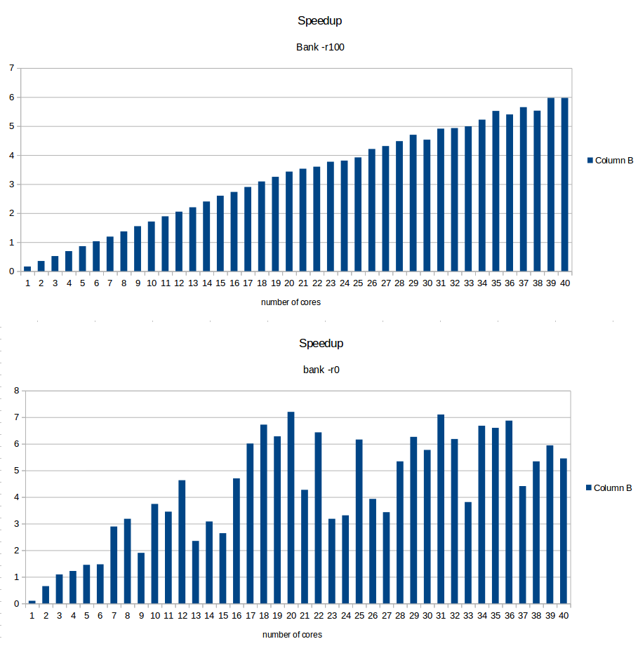
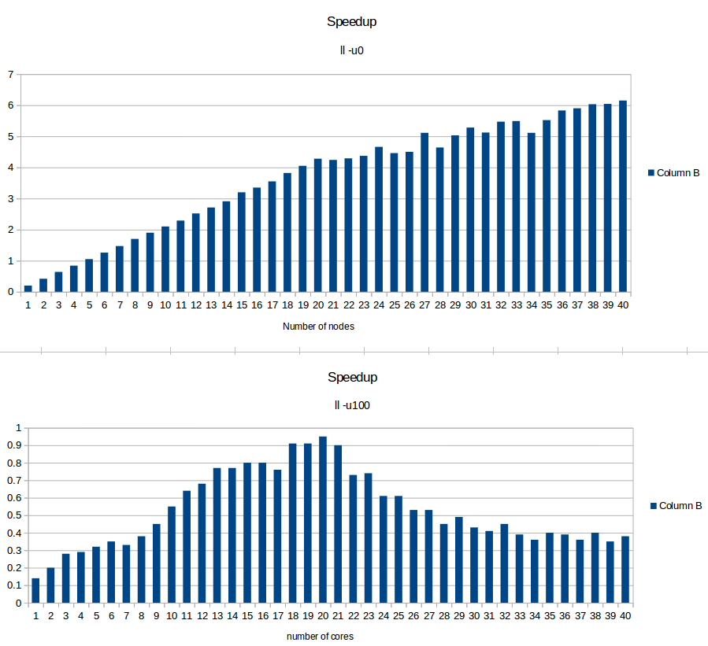

#Concurrent Algorithm projet report (Guillaume Leclerc, 224338)

## Results

All tests were made on 40 core machine (latest intel xeon generation).

\cleardoublepage

## Algorithm

I used a pretty simple algorithm. I start by assuming all transatctions are read only.

I have an array of locks (containing a version number too);

When I start a new transaction I read a global shared clock. This is the begining of the transaction.

When I read and this is a read only transaction. Then I just check nobody wrote it since the begining of the transaction by reading the version of the lock.If it is the case I abort.

When I read and this is a read only transaction. I flag the transaction to write transaction and abord

When I read or write in a write transaction I acquire a lock for every object the transaction visits. If the lock is already acquired then I abort.

## "Analysis"

When there are only read only transactions the speedup is very good. When there are a lot of write transaction this is similar to a 2TPL. 

It performs bad when there are very long read transactions and some write because a lot of read transactions get killed by the write one. I wanted to implement visible read but did'nt have the time.

## Conclustion

Sorry for this very short report but I really did my best with the time I had.
